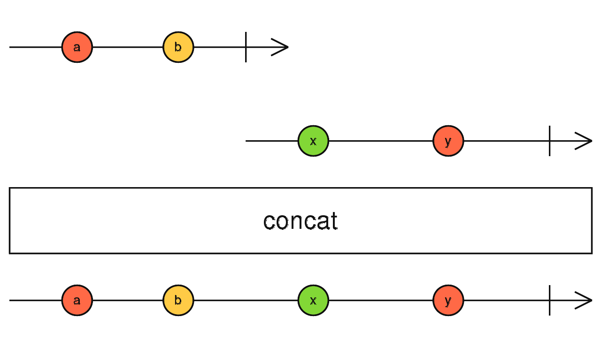
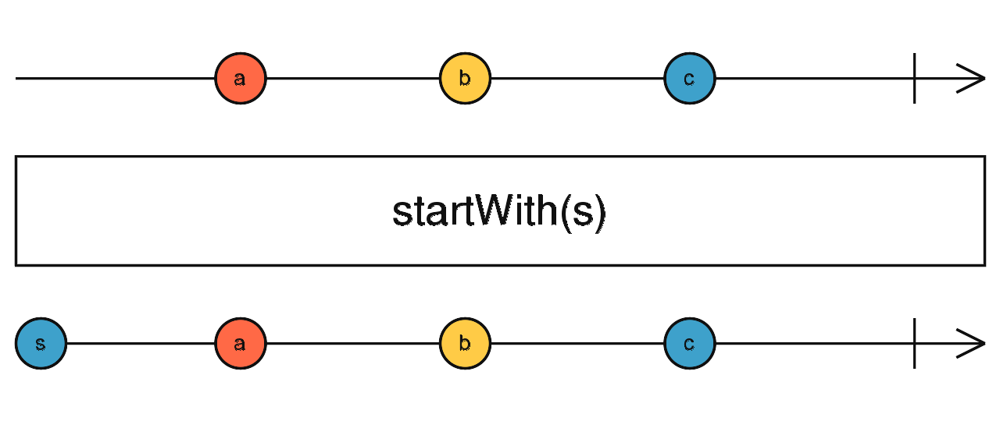

# rxjs学习笔记

> RxJS 是一个库，它通过使用 observable 序列来编写异步和基于事件的程序。


## 异步事件管理的基本概念

* Observable (可观察对象): 表示一个概念，这个概念是一个可调用的未来值或事件的集合。
* Observer (观察者): 一个回调函数的集合，它知道如何去监听由 Observable 提供的值。
* Subscription (订阅): 表示 Observable 的执行，主要用于取消 Observable 的执行。
* Operators (操作符): 采用函数式编程风格的纯函数 (pure function)，使用像 map、filter、concat、flatMap 等这样的操作符来处理集合。
* Subject (主体): 相当于 EventEmitter，并且是将值或事件多路推送给多个 Observer 的唯一方式。
* Schedulers (调度器): 用来控制并发并且是中央集权的调度员，允许我们在发生计算时进行协调，例如 setTimeout 或 requestAnimationFrame 或其他。


## Observable可观察对象

Observable是多个值的惰性推送集合，他解决了一下问题：

|   |  单个 | 多个 |
|---|---|---|
|  拉取 | Function  |  Iterator |
|  推送 | Promise  |  	Observable |


### 拉取与推送

|   |  数据生产者 | 数据消费者 |
|---|---|---|
|  拉取 | 被动：当被请求时产生数据  |  主动：决定何时请求数据 |
|  推送 | 主动：按照自己的节奏产生数据  |  	被动：对接受收到的数据进行响应 |


### 惰性
`Observables`是惰性的，不调用就不会执行。 


### `Observable`创建可观察对象

> `Observable` 可以使用 `create` 来创建, 但通常我们使用所谓的创建操作符, 像 `of`、`from`、`interval`、等等。

```js
const { Observable } = require("rxjs");

const observable = new Observable(observer => {
    let index = 0;
    const id = setInterval(() => {
        observer.next(index++);
        if (index >= 5) {
            clearInterval(id);
            observer.complete();
        }
    }, 1000)
})


console.log("start...");
observable.subscribe(
    e => {console.log(e)},
    err => {console.error(err)},
    () => {console.log(`hear complete`)}
);
console.log("end...")

/*
  start...
  end...
  0
  1
  2
  3
  4
  hear complete
*/

```


### `Observable`执行
Observable 执行可以传递三种类型的值：

*   "Next" 通知： 发送一个值，比如数字、字符串、对象，等等。
*   "Error" 通知： 发送一个 JavaScript 错误 或 异常。
*  "Complete" 通知： 不再发送任何值。

> 在 Observable 执行中, 可能会发送零个到无穷多个 "Next" 通知。如果发送的是 "Error" 或 "Complete" 通知的话，那么之后不会再发送任何通知了。


"Next" 通知是最重要，也是最常见的类型：它们表示传递给观察者的实际数据。"Error" 和 "Complete" 通知可能只会在 Observable 执行期间发生一次，并且只会执行其中的一个。

这些约束用所谓的 Observable 语法或合约表达最好，写为正则表达式是这样的：

```js
const { Observable } = require("rxjs");

var observable = Observable.create(function (observer) {
    observer.next(1);
    observer.next(2);
    observer.next(3);
    setTimeout(() => {
      observer.next(4);
      observer.complete();
    }, 1000);
  });
  
  console.log('just before subscribe');
  observable.subscribe({
    next: x => console.log('got value ' + x),
    error: err => console.error('something wrong occurred: ' + err),
    complete: () => console.log('done'),
  });
  console.log('just after subscribe');


/*
just before subscribe
got value 1
got value 2
got value 3
just after subscribe
got value 4
done
*/
```


### Observer 观察者

观察者是由`Observable`发送的值的消费者。观察者只是一组回调函数的集合，每个回调函数对应一种`Observable`发送的通知类型: `next`、`error` 和 `complete` 。下面的示例是一个典型的观察者对象：

### Subscription 

> Subscription 基本上只有一个 unsubscribe() 函数，这个函数用来释放资源或去取消 Observable 执行。


## 操作符

```js
const { of, Subject }  =  require("rxjs");
const { map } = require("rxjs/operators")

const subject = new Subject();

map(x => x * x)(subject).subscribe(e => console.log(e));

subject.next(3);
// -> 9

subject.next(9);
// -> 81

subject.next(12);
// -> 144
```

### Creation Operators

> https://rxjs-dev.firebaseapp.com/api/ajax/ajax
> 
> It creates an observable for an Ajax request with either a request object with url, headers, etc or a string for a URL.

常用操作符

#### 创建

##### of

> 创建一个 Observable，它会依次发出由你提供的参数，最后发出完成通知。 

```js
const {of} = require("rxjs");

of(1, 2, 3, 4, 5).subscribe(e => console.log(e));
/*
    1,
    2,
    3,
    4,
    5,
*/
```


##### from

> 从一个数组、类数组对象、Promise、迭代器对象或者类 Observable 对象创建一个 Observable.

```js
const {from} = require("rxjs");

from([1, 2, 3]).subscribe(e => console.log(e));

/*
    1,
    2,
    3,
*/
```

##### fromEvent
> 创建一个 Observable，该 Observable 发出来自给定事件对象的指定类型事件。

```js
const { fromEvent } = require("rxjs");

// fromEvent(element, eventName).subscribe(e => console.log(e));
fromEvent(document, 'load').subscribe(e => console.log(`on load`));
```

##### fromPromise


```js
const { fromPromise } = require("rxjs");
const result = fromPromise(fetch('http://myserver.com/'));
result.subscribe(x => console.log(x), e => console.error(e));
```

#### 组合

##### combineLatest
> 它将使用所有输入中的最新值计算公式，然后发出该公式的输出。


```js
const { interval, combineLatest } = require("rxjs");

const observable1 = interval(500);
const observable2 = interval(700);

combineLatest(observable1, observable2)
    .subscribe(e => {
        console.log(e)
    })

/*

[ 0, 0 ] time: 711.087ms = 700 // 第一次触发是a,b都触发
[ 1, 0 ] time: 1005.115ms = 500*2
[ 1, 1 ] time: 1404.494ms = 700*2 
[ 2, 1 ] time: 1505.636ms = 500*3
[ 3, 1 ] time: 2006.421ms = 500*4
[ 3, 2 ] time: 2113.476ms = 700*3

*/
```

##### concat
> 通过顺序地发出多个 Observables 的值将它们连接起来，一个接一个的。



```js
const { concat, interval, range } = require("rxjs");
const { take } = require("rxjs/operators");

const time1 = interval(1000).pipe(take(5))
const time2 = interval(1000).pipe(take(6))
const time3 = interval(1000).pipe(take(7))

console.time("asd")
concat(time1, time2, time3)
    .subscribe(e => {
        console.log(e);
        console.timeLog("asd")
    })
/*

  0   ->   asd: 1008.188ms
  1   ->   asd: 2004.837ms
  2   ->   asd: 3005.695ms
  3   ->   asd: 4006.039ms
  4   ->   asd: 5006.520ms
  0   ->   asd: 6009.689ms
  1   ->   asd: 7010.109ms
  2   ->   asd: 8010.405ms
  3   ->   asd: 9010.657ms
  4   ->   asd: 10010.194ms
  5   ->   asd: 11010.986ms
  0   ->   asd: 12013.436ms
  1   ->   asd: 13026.348ms
  2   ->   asd: 14015.920ms
  3   ->   asd: 15016.341ms
  4   ->   asd: 16016.574ms
  5   ->   asd: 17016.693ms
  6   ->   asd: 18016.555ms

*/
```

##### merge
> 通过把多个 Observables 的值混合到一个 Observable 中来将其打平。


```js
const { interval, merge } = require("rxjs");

const timer1 = interval(500);
const timer2 = interval(600);

console.time("asd")
merge(timer2, timer1)
    .subscribe(e => {
        console.log(e);
        console.timeLog("asd");
    })

/*
0 -> asd: 509.425ms
0 -> asd: 603.273ms
1 -> asd: 1005.020ms
1 -> asd: 1202.815ms
2 -> asd: 1504.404ms
2 -> asd: 1802.827ms
3 -> asd: 2005.755ms
3 -> asd: 2403.422ms
4 -> asd: 2507.326ms
4 -> asd: 3005.008ms
5 -> asd: 3014.245ms
*/
```

##### startWith

> 返回的 Observable 会先发出作为参数指定的项，然后再发出由源 Observable 所发出的项。



```js
const { interval } = require("rxjs");
const { startWith, take } = require("rxjs/operators");

const timer = interval(1000);

timer.pipe(startWith("啊哈哈哈哈哈"), take(5)).subscribe(console.log)
/*
啊哈哈哈哈哈
0
1
2
3
*/

```

##### withLatestFrom

> 结合源 Observable 和另外的 Observables 以创建新的 Observable， 该 Observable 的值由每 个 Observable 最新的值计算得出，当且仅当源发出的时候。


```js

const { interval } = require("rxjs");
const { withLatestFrom, take, startWith } = require("rxjs/operators");


const event = interval(300).pipe(take(10));
const filter = interval(1000).pipe(startWith("啊哈哈哈"));

event.pipe(take(5), withLatestFrom(filter)).subscribe(console.log);

/*
[ 0, '啊哈哈哈' ]
[ 1, '啊哈哈哈' ]
[ 2, '啊哈哈哈' ]
[ 3, 0 ]
[ 4, 0 ]
*/

```

##### zip

> 将多个 Observable 组合以创建一个 Observable，该 Observable 的值是由所有输入 Observables 的值按顺序计算而来的。
> 
> 如果最后一个参数是函数, 这个函数被用来计算最终发出的值.否则, 返回一个顺序包含所有输入值的数组.
>
> zip工作原理如下，当每个传入zip的流都发射完毕第一次数据时，zip将这些数据合并为数组并发射出去；当这些流都发射完第二次数据时，zip再次将它们合并为数组并发射。以此类推直到其中某个流发出结束信号，整个被合并后的流结束，不再发射数据。

```js
const { interval } = require("rxjs");
const { zip, take } = require("rxjs/operators");

const timer1 = interval(100);
const timer2 = interval(400);
const timer3 = interval(1000);

console.time("asd");

// 最后一个参数为函数，则可以用来处理数据
// timer1.pipe(zip(timer2, timer3, (a, b, c) => a+b+c)).subscribe(console.log)

timer1.pipe(zip(timer2, timer3), take(3)).subscribe(e => {
    console.timeLog("asd");
    console.log(e)
})

/*
asd: 1003.582ms -> [ 0, 0, 0 ]
asd: 2003.687ms -> [ 1, 1, 1 ]
asd: 3004.310ms -> [ 2, 2, 2 ]
*/
```


#### 过滤
##### debounceTime
> 就像是delay, 但是只通过每次大量发送中的最新值。


```js


```
##### distinctUntilChanged
##### filter
##### take
##### takeUntil


#### 转换
##### bufferTime
##### concatMap
##### map
##### mergeMap
##### scan
##### switchMap


#### 工具
##### tap

#### 多播
##### share